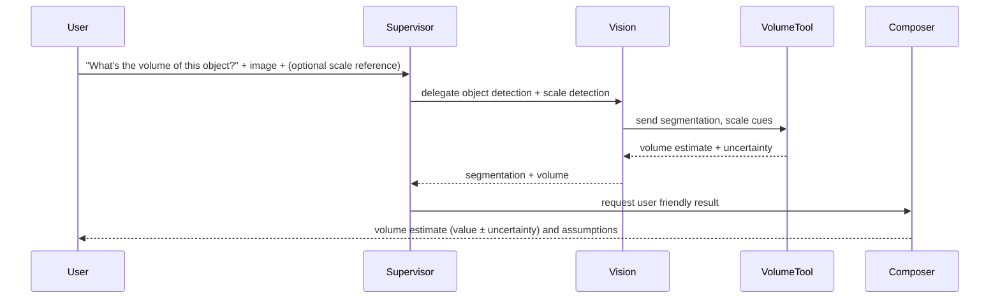

# Multi‑Agent Flow Diagrams

**Purpose:** Visualize how the supervisor agent orchestrates the Vision, Nutrition, and Summarizer agents (and their tools) to respond to different user queries. Each section contains a flowchart and a numbered step sequence describing the interactions.

---

## Legend

* **User** — the person sending a query.
* **Supervisor Agent** — orchestrator; parses intent, delegates tasks, merges results, handles fallbacks and clarifying questions.
* **Vision Agent** — processes images; uses *volume estimator* and *OCR* tools; returns recognized objects, bounding boxes, segmentation masks, OCR text, and measured volume.
* **Nutrition Agent** — analyzes food items and nutrition facts; uses *nutrition vector search* (nutrition DB) and *web search* for supplemental info; returns nutrient breakdown, confidence and provenance.
* **Summarizer Agent** — retrieves and summarizes user profile, history, and past nutrition data; tools: *user DB search* and *web search* (for public guidelines); returns a short contextual summary.
* **Composer / Response Aggregator** — finalizes how the answer is presented (explanations, recommended actions, citations).
* **Databases & Tools:** Nutrition DB (vector index), User DB, Volume Estimator, OCR Engine, Web Search.

---

# A — "Explain nutrition from a food image" (composite multimodal query)

```mermaid
flowchart TD
  U[User: "What's the nutrition in this food?" + image]
  SUP[Supervisor Agent]
  VISION[Vision Agent]
  OCR[OCR Tool]
  VOL[Volume Estimator]
  NUT[Nutrition Agent]
  NDB[Nutrition DB (Vector Search)]
  WN[Web Search]
  SUM[Summarizer Agent]
  UDB[User Info DB]
  COMP[Response Composer]

  U -->|query + image| SUP
  SUP -->|delegate: identify food items & labels| VISION
  VISION -->|segment food & return volumes| VOL
  VOL -->|volume estimate (m^3)| NUT
  VISION -->|run OCR on label areas if no prediction| OCR
  OCR -->|nutrition label text| NUT
  VISION -->|detected food items (image tags)| NUT
  NUT -->|vector search for known foods| NDB
  NUT -->|if low confidence or missing data -> web lookup| WN
  SUP -->|also ask for context summary| SUM
  SUM -->|search profile + dietary constraints| UDB
  SUM -->|summarized context| NUT
  NUT -->|nutrient breakdown + confidence| COMP
  SUM -->|context summary| COMP
  COMP -->|final answer with sources & suggestions| U
```

**Step sequence (A)**

1. Supervisor parses the question, extracts the image, and intent "nutrition explanation".
2. Supervisor delegates to Vision Agent: Vision Agent  calls Volume Estimator on the food image to estimate serving size. This agent calls the OCR tool if there is no prediction from the Volume Estimator tool. 
3. Vision Agent returns detected items, segmentation & volume estimate to the Supervisor and Nutrition Agent.
4. Nutrition Agent queries Nutrition DB via vector search for best matches to detected food names and OCR-parsed label keys; if insufficient, falls back to web search.
5. Nutrition Agent combines predicted food, OCR label values (if present), with database matches and volume estimate to compute an estimated nutrient breakdown and per-serving macros.
6. Supervisor triggers Summarizer Agent to fetch user profile (allergies, goals, previous meals) from User DB and summarize.
7. Composer merges nutrition results, confidence levels, and user summary into a human-friendly reply with suggestions and safety notes.
8. Supervisor returns final response to the user; logs actions and updates usage telemetry.

---

# B — "Extract nutrition facts from a nutrition label image" (OCR-first)

```mermaid
flowchart LR
  U2[User: "Read the nutrition label" + label image]
  SUP2[Supervisor Agent]
  V2[Vision Agent]
  OCR2[OCR Tool]
  CLEAN[Text Normalizer]
  N2[Nutrition Agent]
  NDB2[Nutrition DB (Vector Search)]
  WN2[Web Search]
  COMP2[Response Composer]

  U2 --> SUP2
  SUP2 -->|delegate: OCR & parse label| V2
  V2 --> OCR2
  OCR2 --> CLEAN
  CLEAN --> N2
  N2 --> NDB2
  N2 -->|if field ambiguous| WN2
  N2 --> COMP2
  COMP2 --> U2
```

**Step sequence (B)**

1. Supervisor receives label image and routes to Vision Agent for OCR-focused processing.
2. Vision Agent runs OCR and applies a text normalizer/parser to map OCR tokens to nutrition fields (e.g., calories, fat, sodium).
3. Nutrition Agent validates parsed values against Nutrition DB (vector search) to catch OCR errors or missing units; uses web search for brand-specific formats if necessary.
4. Nutrition Agent returns a validated, normalized nutrition facts table with confidence per field.
5. Composer formats and returns a readable nutrition facts output to the user.

---

# C — "Estimate object volume from an image" (measurement-only)



**Step sequence (C)**

1. Supervisor checks whether the user provided any scale reference (ruler, coin) or metadata (sensor depth); if not, ask a clarifying question or proceed with assumptions.
2. Vision Agent calls tool
3. Volume Estimator computes volume and returns uncertainty bounds.
4. Supervisor composes result with explicit assumptions (e.g., "estimated using a reference coin; ± 12% uncertainty").

---

# D — "Personalized meal planning" (goal-driven, multi-day)

```mermaid
flowchart TD
  U5[User: "Create a 7-day meal plan for me" + preferences]
  SUP5[Supervisor Agent]
  SUM5[Summarizer Agent]
  UDB5[User Info DB]
  NUT5[Nutrition Agent]
  NDB5[Nutrition DB (Vector Search)]
  WN5[Web Search]
  PLAN[Meal Planning Engine]
  COMP5[Response Composer]

  U5 --> SUP5
  SUP5 --> SUM5
  SUM5 -->|retrieve diet history, goals, allergies| UDB5
  SUM5 --> SUP5
  SUP5 --> NUT5
  NUT5 -->|fetch nutrient data for food candidates| NDB5
  NUT5 -->|missing items / recipes| WN5
  NUT5 --> PLAN
  SUM5 --> PLAN
  PLAN -->|generate balanced meal plan + macros| COMP5
  COMP5 --> U5
```

**Step sequence (D – Meal planning)**

1. Supervisor extracts planning horizon (e.g., 7 days), dietary goals (cutting, bulking, maintenance), and preferences (vegetarian, halal, etc.).
2. Summarizer Agent queries User DB to retrieve allergies, intolerances, past meals, target calories and macros.
3. Nutrition Agent pulls candidate foods/recipes and nutrient profiles from Nutrition DB; uses web search for missing or regional dishes.
4. Meal Planning Engine assembles breakfasts, lunches, dinners, and optional snacks to meet constraints (calories, macros, variety, budget).
5. Composer formats the plan, daily macro totals, grocery list, and preparation notes, then delivers to the user.

# Quick reference: which agent uses which tool

* **Vision Agent:** OCR Engine, Volume Estimator, segmentation model, image metadata extractor.
* **Nutrition Agent:** Nutrition DB (vector search), Web Search, unit normalizer, nutrient calculator.
* **Summarizer Agent:** User DB search, Web Search for guidelines, summarization pipeline.
* **Supervisor Agent:** Intent parser, delegation logic, timeout/retry policy, security/consent checks, final orchestration.

# Common orchestration patterns & failure handling

1. **Parallelization:** Supervisor can run Vision and Summarizer in parallel (useful for speed) and wait for both replies before asking Nutrition Agent to finalize.
2. **Confidence thresholds & fallbacks:** Each agent returns a `confidence` value. If Nutrition Agent confidence is low, the Supervisor requests a web lookup or asks the user for clarification.
3. **Tool access policy:** Agents only use permitted tools (e.g., Nutrition Agent's vector search for private DBs; web search for public sources). All web-sourced claims are annotated with provenance.
4. **Privacy guardrails:** Summarizer fetches user info only after the Supervisor confirms user authorization; logs are redacted where required.
5. **Explainability:** Composer lists the data sources used (OCR text, nutrition DB match, web link) and shows uncertainty estimates and assumptions (serving size, volume conversion factors).
