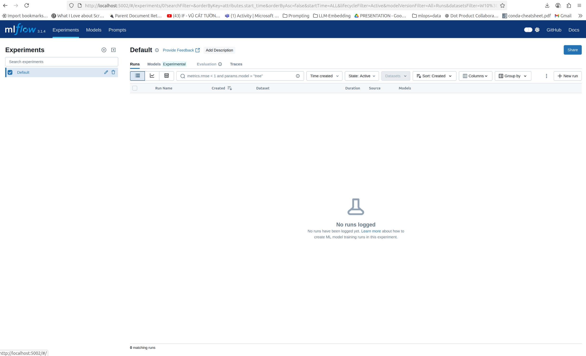
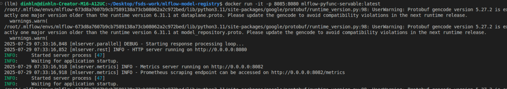
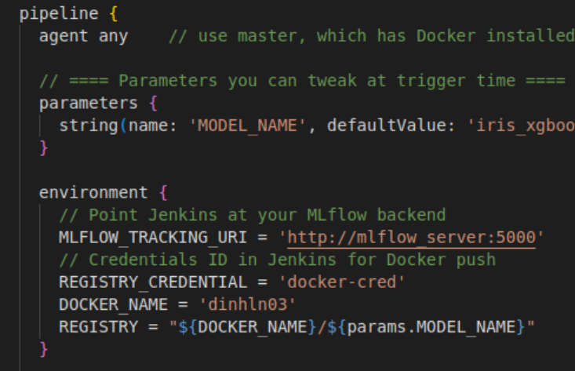
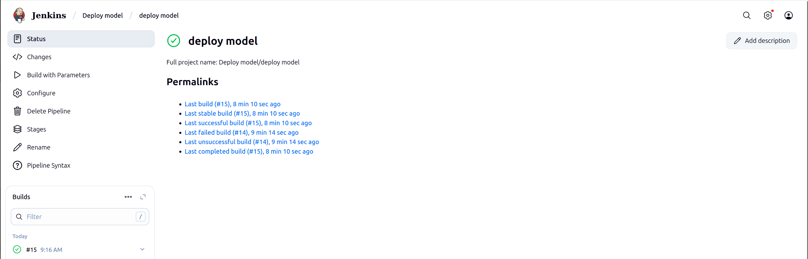
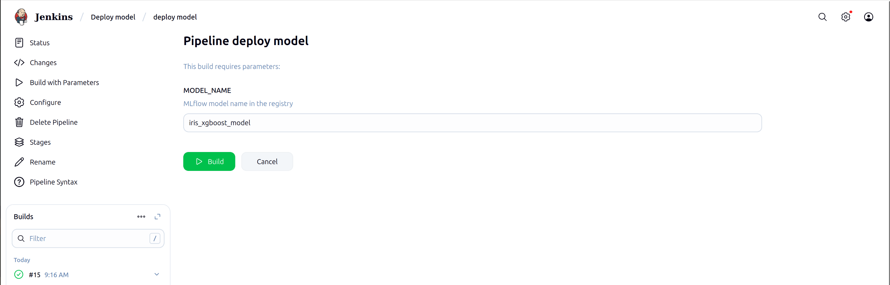
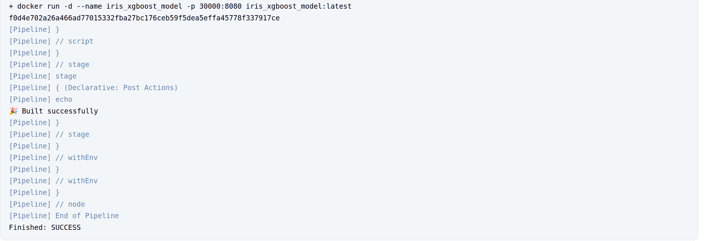

# I. Set up

## 1. Install the required dependencies:

```bash
uv sync --all-groups
```

## 2. Create a `.env` file 

Create a `.env` file in the root directory using .env.example as a template

## 3. Run up mlflow

```bash
make mlflow-up
```

## 4. Check the status of the services:

```bash
make mlflow-logs
```

5. Export environment variables:

```bash
set -a && source .env && set +a
```

# II. How to guide

## 1. Open the MLflow UI in your browser:

```
http://localhost:5002
```


## 2. Run the notebook `xgboost.ipynb` 

Expore in the `notebooks` directory to see how to use MLflow with XGBoost.

## 3. Containerize model server with MLServer (Optional):

```bash
MODEL_URI='mlruns'
uv run mlflow models build-docker -m $MODEL_URI --enable-mlserver
```
It first builds the model image and then runs it locally. You can access the model server at: `http://localhost:8095` after running:

```bash
docker run -it -p 8095:8080 mlflow-pyfunc-servable:latest
```


## 4. Generate Dockerfile for the model (Optional):

```bash
MODEL_URI='mlruns'
uv run mlflow models generate-dockerfile -m $MODEL_URI --enable-mlserver --output-directory .
```
This will create a Dockerfile in the current dir.

## 5. Run Jenkins service:

```bash
make jenkins-up
```
This will start the Jenkins service in the background. You can access it at `http://localhost:8081`.

## 6. Get Jenkins admin password:

```bash
sudo docker exec -it jenkins cat /var/jenkins_home/secrets/initialAdminPassword
```

## 7. Access the Jenkins UI 

Access the Jenkins UI and install the recommended plugins. Follow lecture CI/CD to set up a single-branch pipeline for your model deployment. Note that, specify Jenkins file at : `jenkins_file/Jenkinsfile-input-params`.

Also remember to change to your Docker name:


## 8. Click to your pipeline in Jenkins and run it by clicking: `Build with your Parameters`. 

You can monitor the build process in the console output.




## 9. After the pipeline completes, you can check the Docker images:

```bash
docker images
```
You should see your model image listed.

## 10. Check the Docker hub to see if the image has been pushed successfully:


## 11. Clean up the environment:

```bash
make infra-down
```
